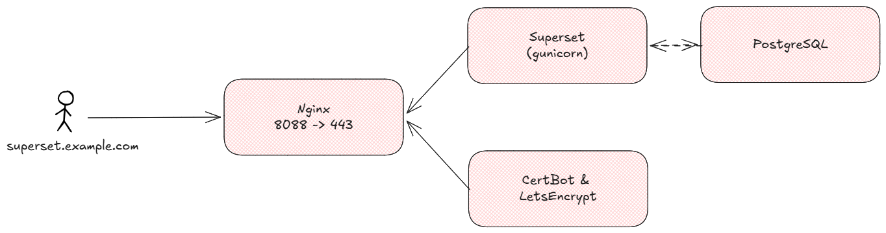

# Ansible Playbook to Install Apache Superset

Stack Architecture
<p align="center">  </p>

## 1. Prequesites
- 1 or more node servers (this playbook support ubuntu server)
- Installed and configured ansible in server who will run the ansible playbook

## 2. Running the Playbook
Before running make sure the `inventory` was fiiled. Then you can run with
```sh
ansible-playbook -i inventory deploy_superset.yml
```
Ansible galaxy
```sh
ansible-galaxy collection install -r requirements.yml
```